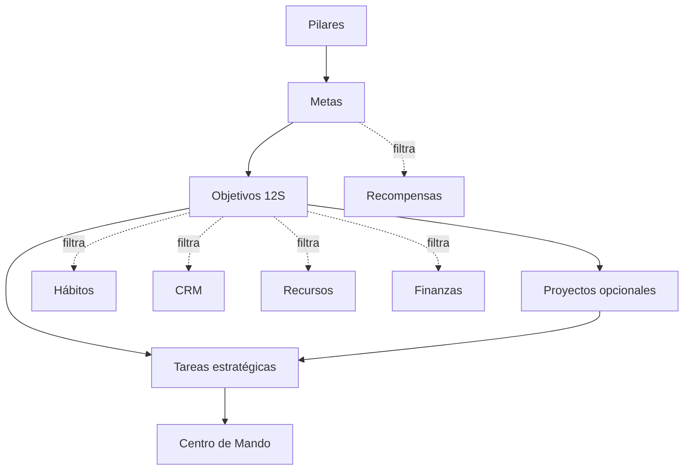
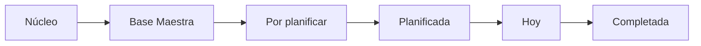

# Mossie — Núcleo Estratégico

## Requerimientos funcionales y técnicos para integración

**Versión:** 1.0  
**Estado:** Aprobado para planificación técnica  
**Audiencia:** Ingeniería de software, UX/UI y QA  
**Módulo:** Núcleo Estratégico  
**Integra con:** Centro de Mando, Base Maestra de Tareas, GTD, Pilares, Hábitos, Proyectos, CRM, Finanzas, Recursos, Recompensas y Planificadores

---

## 0. Cómo debe utilizarse este documento

Este documento define el comportamiento que debe construirse para incorporar el Núcleo Estratégico al sistema existente de Mossie. No es una evaluación del prototipo ni una propuesta aislada. Es el contrato funcional de integración.

Antes de implementar, el ingeniero debe:

1. leer el archivo equivalente del repositorio;
2. revisar el documento vigente del Centro de Mando;
3. revisar el flujo GTD unificado vigente;
4. inspeccionar el esquema real, migraciones, rutas y componentes existentes;
5. mapear los nombres aquí propuestos contra los nombres reales del código;
6. implementar mediante migraciones y cortes verticales pequeños;
7. preservar las funciones existentes que no formen parte del cambio.

Si el esquema actual utiliza otro nombre para una entidad equivalente, no se debe crear una copia solo para coincidir con este documento. Se reutiliza la entidad existente y se documenta el mapeo.

---

## 1. Resultado esperado

El Núcleo Estratégico debe permitir que la usuaria convierta una aspiración en una ruta ejecutable y conecte esa ruta con su operación diaria.

La cadena funcional aprobada es:

```text
Pilar
  └── Meta o sueño
        └── Objetivo de 12 semanas
              ├── Proyecto opcional
              │     └── Tareas estratégicas
              └── Tareas estratégicas directas
```

Los siguientes elementos complementan la ruta, pero no agregan niveles jerárquicos:

- ciclos de 12 semanas;
- semanas del ciclo;
- hitos;
- indicadores;
- hábitos;
- riesgos;
- presupuesto y movimientos financieros;
- colaboradores;
- mentores;
- recursos;
- recompensas;
- revisiones.

El módulo debe responder claramente:

- ¿Qué quiero lograr?
- ¿Por qué es importante?
- ¿Qué objetivo estoy trabajando en este ciclo?
- ¿Qué resultado demuestra que lo logré?
- ¿En qué estoy trabajando ahora?
- ¿Qué corresponde esta semana?
- ¿Cuál es la próxima acción?
- ¿Estoy ejecutando el plan?
- ¿Estoy consiguiendo el resultado?

---

## 2. Principios obligatorios

### 2.1 Una sola fuente de verdad

Cada registro vive en una sola entidad maestra. El Núcleo consulta, crea relaciones y presenta vistas filtradas; no copia registros de otros módulos.

### 2.2 El Núcleo planifica; el Centro de Mando ejecuta

- En el Núcleo se piensa, diseña, compara, activa, organiza y revisa la estrategia.
- En el Centro de Mando se ve y ejecuta lo relevante del día.
- El Home no debe incorporar formularios largos del Núcleo.
- El Núcleo no debe convertirse en una segunda lista diaria de tareas.

### 2.3 Las tareas estratégicas usan la Base Maestra de Tareas

Las tareas creadas desde una meta, objetivo o proyecto se guardan en la entidad maestra de tareas. No pasan por Inbox porque nacen clasificadas y con contexto conocido.

### 2.4 Las semanas son una vista de planificación

Semana 1 a Semana 12 no constituye un nivel de la jerarquía. Es una organización temporal de proyectos, hitos, tareas y hábitos ya existentes.

### 2.5 Proyecto opcional

No se obliga a crear un proyecto para cada objetivo. Si una acción puede gestionarse como tarea directa, se relaciona con el objetivo sin proyecto intermedio.

### 2.6 Proyecto independiente permitido

Un proyecto puede existir sin meta ni objetivo. Siempre debe tener al menos un pilar relacionado.

Ejemplo: preparar una charla profesional que pertenece al pilar Trabajo, pero no forma parte de una meta activa.

### 2.7 Manual primero

Todo el flujo debe funcionar sin IA, n8n, MCP ni servicios externos. La automatización futura no puede ser requisito para crear, planificar, ejecutar o cerrar una meta.

### 2.8 IA confirmable

Cuando se agregue IA, esta podrá sugerir y preparar borradores. No podrá activar metas, guardar planes definitivos, crear grandes lotes de tareas, mover dinero, enviar mensajes o reprogramar sin confirmación.

### 2.9 Móvil primero

La experiencia debe diseñarse inicialmente para 360–430 px y adaptarse después a tableta y escritorio. Ninguna acción esencial puede depender de hover.

### 2.10 Sin culpa

Los estados y alertas deben ser claros, pero serenos. El sistema muestra realidad, riesgo y opciones; no castiga ni utiliza lenguaje acusatorio.

---

## 3. Alcance

### 3.1 Incluido en la primera versión funcional

- tablero visual de metas o vision board;
- creación, edición y archivo de metas;
- comparación y activación manual de metas;
- límite de tres metas activas;
- ciclos de 12 semanas;
- creación manual de objetivos SMART;
- entre uno y tres objetivos activos en total por ciclo;
- constructor guiado de ruta;
- proyectos vinculados a objetivos;
- proyectos independientes vinculados a pilares;
- hitos e indicadores;
- tareas estratégicas directas o mediante proyecto;
- vista Plan de 12 semanas;
- relaciones filtradas con Hábitos, CRM, Recursos, Finanzas y Recompensas;
- progreso de ejecución y progreso de resultado;
- estado temporal del objetivo;
- riesgos, prevención y respuesta;
- historial mínimo de cambios y revisiones;
- componente compacto del Núcleo en Centro de Mando;
- estados de carga, vacío, error y confirmación;
- persistencia real y seguridad por usuario.

### 3.2 Preparado, pero no implementado ahora

- generación del plan mediante IA;
- comparación inteligente de estrategias;
- detección automática de sobrecarga;
- generación automática de riesgos;
- revisión semanal redactada por IA;
- automatizaciones con n8n;
- conexión mediante MCP;
- sincronización con servicios externos;
- compra o desembolso automático de recompensas;
- acciones autónomas sin confirmación.

### 3.3 Fuera del alcance del Núcleo

- redefinir el flujo completo del Inbox;
- crear otra base de tareas;
- duplicar Hábitos, CRM, Finanzas, Recursos o Recompensas;
- convertir el Centro de Mando en planificador estratégico;
- implementar todos los módulos centrales pendientes solo para simular relaciones;
- almacenar información clínica identificable de pacientes.

---

## 4. Arquitectura de información

### 4.1 Mapa de módulos



Las líneas continuas representan jerarquía o generación directa. Las líneas discontinuas representan relaciones entre módulos maestros.

### 4.2 Entidades propiedad del Núcleo

- metas;
- ciclos estratégicos;
- objetivos;
- indicadores;
- hitos;
- riesgos;
- revisiones estratégicas;
- asignaciones del Plan de 12 semanas;
- relaciones específicas del Núcleo con entidades externas.

### 4.3 Entidades reutilizadas

- usuarios y perfiles;
- pilares;
- tareas;
- proyectos, si ya existe una entidad maestra;
- hábitos y registros de hábitos;
- personas y seguimientos del CRM;
- recursos PARA;
- presupuestos, fondos y transacciones;
- recompensas o lista de deseos;
- archivos o adjuntos;
- sesiones de enfoque;
- historial o auditoría común.

### 4.4 Regla de integración progresiva

Si un módulo relacionado todavía no está construido:

- el Núcleo debe funcionar sin ese módulo;
- la sección relacionada muestra un estado vacío explicativo;
- se permite ocultar la pestaña mediante feature flag;
- no se crea una versión temporal duplicada de la entidad;
- la relación se añade cuando exista el módulo maestro.

---

## 5. Navegación y rutas

Las rutas pueden adaptarse a la convención real del repositorio. Comportamiento recomendado:

```text
/strategic                         Tablero del Núcleo
/strategic/goals/new               Constructor de meta
/strategic/goals/:goalId           Detalle de meta
/strategic/goals/:goalId/edit      Edición de meta
/strategic/cycles/:cycleId         Resumen del ciclo
/strategic/objectives/new          Constructor de objetivo
/strategic/objectives/:objectiveId Detalle del objetivo
/strategic/projects                Catálogo de proyectos
/strategic/projects/:projectId     Detalle de proyecto
/strategic/reviews/:reviewId       Revisión estratégica
```

Accesos mínimos:

- navegación principal: `Núcleo Estratégico`;
- Centro de Mando: botón `Ver ruta`;
- detalle de pilar: sección de metas y proyectos relacionados;
- detalle de tarea: enlaces a objetivo o proyecto cuando existan;
- detalle de proyecto: enlace al objetivo cuando sea estratégico.

### 5.1 Breadcrumbs

Ejemplos:

```text
Núcleo Estratégico / Meta / Objetivo
Pilar / Proyecto independiente
```

En móvil se muestra volver + título corto. El breadcrumb completo puede ocultarse visualmente, pero debe conservarse para navegación y accesibilidad.

---

## 6. Pantallas y experiencia UX

## 6.1 Pantalla A — Tablero del Núcleo

### Propósito

Mostrar la visión general, facilitar la selección de prioridades estratégicas y permitir entrar a cada ruta.

### Encabezado

- título `Núcleo Estratégico`;
- ciclo actual: `Semana X de 12`;
- acción primaria `Nueva meta`;
- acción secundaria `Planificar ciclo` o `Ver ciclo`;
- filtros: pilar, estado y horizonte;
- búsqueda por título.

### Resumen compacto

- progreso promedio de resultado de metas activas;
- metas en ruta;
- metas que requieren atención;
- cantidad de metas activas de tres permitidas;
- objetivos activos de uno a tres permitidos.

### Tarjeta de meta

Debe mostrar:

- imagen principal;
- pilar y color del pilar;
- título;
- frase breve de visión, máximo dos líneas;
- estado;
- progreso general de resultado;
- horizonte o fecha estimada;
- indicador de atención si aplica;
- menú contextual.

Interacciones:

- tocar tarjeta: abrir detalle;
- menú `…`: editar, activar, pausar, duplicar como borrador, archivar o descartar;
- no permitir activación directa si se alcanzó el máximo;
- al alcanzar el límite, abrir comparación de metas activas.

### Filtros de tablero

- `Activas` por defecto;
- `Todas`;
- `Planificadas`;
- `En pausa`;
- `Logradas`;
- `Archivadas`.

### Estado vacío

Mensaje: `Todavía no tienes metas creadas.`  
Acción: `Crear mi primera meta`.

No se debe mostrar un dashboard lleno de ceros.

---

## 6.2 Pantalla B — Constructor de meta

Debe funcionar como formulario progresivo. Guardar borrador automáticamente después de cada paso válido.

### Paso 1 — Aspiración

Campos:

- título provisional;
- descripción libre;
- imagen opcional;
- pilar requerido;
- por qué importa;
- horizonte aproximado.

Botones:

- `Cancelar`;
- `Guardar borrador`;
- `Continuar`.

### Paso 2 — Definición de meta

Campos:

- título final;
- visión o resultado amplio;
- criterio general de logro;
- fecha estimada opcional;
- impacto 1–5;
- urgencia 1–5;
- deseo 1–5;
- costo estimado opcional;
- esfuerzo estimado 1–5;
- atención actual del pilar 1–10.

### Paso 3 — Comparación y activación

Mostrar:

- metas activas actuales;
- capacidad disponible;
- resumen de impacto, esfuerzo, costo y urgencia;
- advertencia suave si ya existen tres metas activas.

Acciones:

- `Guardar para después`;
- `Planificar sin activar`;
- `Activar meta`;
- `Comparar con activas`.

La activación siempre es una decisión manual.

### Paso 4 — Recompensa opcional

Permitir:

- seleccionar recompensa existente;
- crear relación sin duplicar la recompensa;
- indicar condición de desbloqueo;
- omitir el paso.

### Cierre

Después de guardar:

- `Crear objetivo de 12 semanas`;
- `Ver meta`;
- `Volver al tablero`.

---

## 6.3 Pantalla C — Detalle de meta

### Cabecera visual

- imagen;
- título;
- pilar;
- visión;
- motivo;
- estado;
- horizonte;
- progreso general;
- `Editar`;
- menú contextual.

### Secciones

1. objetivo activo destacado;
2. objetivos planificados;
3. objetivos completados;
4. recompensas relacionadas;
5. historial resumido.

### Tarjeta de objetivo

- título;
- ciclo;
- fecha de inicio y fin;
- estado temporal;
- progreso de ejecución;
- progreso de resultado;
- próxima acción;
- botón `Ver ruta estratégica`.

### Acciones

- `Nuevo objetivo`;
- `Activar`;
- `Pausar`;
- `Cerrar objetivo`;
- `Editar meta`.

---

## 6.4 Pantalla D — Constructor de objetivo y ruta

Este flujo es obligatorio. El prototipo visual anterior mostraba el plan terminado, pero no ayudaba a construirlo.

### Paso 1 — Resultado de 12 semanas

- meta relacionada requerida;
- título del objetivo;
- descripción;
- por qué este objetivo ahora;
- punto de partida;
- resultado esperado;
- criterio de finalización;
- ciclo;
- fecha de inicio;
- fecha final calculada o elegida dentro del ciclo.

Validaciones:

- el objetivo debe caber razonablemente en un ciclo;
- si es demasiado amplio, mostrar recomendación para dividirlo;
- no bloquear el guardado del borrador por una recomendación.

### Paso 2 — Indicadores

Crear entre uno y tres indicadores sencillos.

Por indicador:

- nombre;
- tipo de medición;
- valor inicial;
- valor meta;
- unidad;
- dirección deseada;
- peso;
- fuente de actualización;
- frecuencia de revisión.

Acciones:

- `Añadir indicador`;
- `Eliminar`;
- `Continuar sin indicador`, solo en borrador;
- impedir activación sin al menos un criterio verificable.

### Paso 3 — Estrategia

La usuaria debe poder registrar varias alternativas antes de escoger.

Por alternativa:

- nombre;
- descripción;
- beneficios;
- esfuerzo;
- costo;
- tiempo;
- riesgos;
- dependencias;
- estado: candidata, seleccionada o descartada.

Acciones:

- `Añadir alternativa`;
- `Comparar`;
- `Seleccionar estrategia`.

### Paso 4 — Hitos

Por hito:

- título;
- descripción;
- criterio verificable;
- fecha objetivo;
- tipo: resultado u operativo;
- indicador relacionado opcional;
- evidencia opcional;
- condición de recompensa opcional.

### Paso 5 — Proyectos

Preguntar: `¿Este objetivo necesita uno o varios proyectos?`

Opciones:

- `Sí, crear proyecto`;
- `Vincular proyecto existente`;
- `No, trabajar con tareas directas`.

No forzar proyectos artificiales.

### Paso 6 — Tareas estratégicas

Permitir crear tareas individualmente o mediante entrada rápida de varias líneas.

Campos mínimos al crear desde aquí:

- título requerido;
- objetivo o proyecto heredado;
- pilar heredado;
- tipo `strategic`;
- estado inicial `to_plan` o equivalente;
- duración opcional;
- energía opcional;
- fecha límite opcional;
- responsable opcional.

Regla: estas tareas no van a Inbox. Quedan listas para planificación.

### Paso 7 — Hábitos

Acciones:

- `Vincular hábito existente`;
- `Crear hábito` abriendo el formulario del módulo Hábitos;
- `Omitir`.

La relación se guarda en el Núcleo; la definición del hábito sigue viviendo en Hábitos.

### Paso 8 — Personas y mentores

Dos categorías visibles:

- colaboradores directos;
- mentores de referencia.

Acciones:

- `Vincular contacto` desde CRM;
- `Añadir seguimiento` en CRM;
- `Vincular mentor`;
- `Vincular recurso del mentor`.

### Paso 9 — Recursos

- buscar recurso existente;
- filtrar por área PARA;
- relacionar recurso;
- crear nuevo recurso en su módulo;
- adjuntar enlace o archivo mediante el flujo maestro disponible.

### Paso 10 — Presupuesto

- costo estimado;
- presupuesto asignado;
- fondo o categoría financiera;
- gastos previstos opcionales;
- advertencia si no hay fondos suficientes;
- opción de continuar reconociendo el riesgo.

No crear transacciones al estimar presupuesto.

### Paso 11 — Riesgos

Por riesgo:

- título;
- descripción;
- probabilidad;
- impacto;
- señal de alerta;
- acción preventiva;
- plan de respuesta;
- responsable opcional;
- estado.

### Paso 12 — Plan de 12 semanas

Distribuir registros existentes por semana:

- enfoque;
- resultado esperado;
- proyectos activos;
- hitos previstos;
- tareas seleccionadas;
- hábitos relacionados;
- carga estimada;
- observaciones.

### Paso 13 — Comprobación de viabilidad

Mostrar resumen:

- cantidad de tareas;
- duración estimada por semana;
- hábitos activos;
- proyectos concurrentes;
- presupuesto estimado y disponible;
- colaboradores y dependencias;
- semanas sobrecargadas;
- elementos sin fecha o sin responsable cuando sean relevantes.

Acciones:

- `Volver y ajustar`;
- `Guardar como borrador`;
- `Confirmar ruta`.

### Paso 14 — Activación

Antes de activar:

- validar límite global de uno a tres objetivos activos;
- validar meta activa;
- validar indicador o criterio de resultado;
- solicitar confirmación;
- registrar evento de auditoría.

---

## 6.5 Pantalla E — Detalle del objetivo

### Cabecera

- meta y pilar;
- título;
- ciclo y semana actual;
- estado temporal;
- progreso de ejecución;
- progreso de resultado;
- acciones `Editar`, `Revisar`, `Pausar` y menú `…`.

### Respuestas rápidas

Mostrar cuatro tarjetas compactas:

1. `¿Qué quiero lograr?`
2. `¿En qué trabajo ahora?`
3. `¿Cuál es mi próxima acción?`
4. `¿Estoy consiguiendo el resultado?`

Las respuestas 2 y 3 deben ser calculables desde relaciones activas, con posibilidad de ajuste manual controlado.

### Pestañas

#### Visión general

- indicadores;
- hitos próximos;
- riesgos y alertas;
- acciones preventivas;
- planes de respuesta;
- resumen presupuestario;
- estado temporal;
- última revisión.

#### Ruta

- proyectos estratégicos;
- hitos por proyecto o directos;
- tareas estratégicas;
- dependencias;
- próxima acción.

#### Plan 12 semanas

- selector Semana 1–12;
- vista de lista en móvil;
- tablero o línea temporal en tableta/escritorio;
- asignación y movimiento de elementos;
- resumen de carga.

#### Hábitos

- hábitos filtrados por relación;
- frecuencia;
- adherencia de la semana;
- acceso al detalle del hábito.

#### Personas y mentores

- colaboradores desde CRM;
- responsabilidad;
- siguiente seguimiento;
- mentores de referencia;
- recursos recomendados.

#### Recursos

- recursos PARA relacionados;
- tipo;
- enlace;
- estado;
- acción `Abrir`.

#### Historial

- revisiones semanales;
- cambios de estado;
- modificaciones de indicadores;
- replanificaciones;
- cierre del objetivo.

---

## 6.6 Pantalla F — Plan de 12 semanas

### Comportamiento

- Semana 1 a Semana 12 son contenedores visuales del ciclo.
- Asignar un elemento a una semana crea una relación de planificación, no una copia.
- Mover un elemento actualiza esa relación.
- Una tarea conserva su fecha límite independiente de la semana planificada.
- Una tarea puede tener fecha de ejecución dentro de la Base Maestra.
- Fecha límite, fecha de ejecución y semana estratégica no son equivalentes.
- Un proyecto puede abarcar varias semanas.
- Un hito tiene una fecha objetivo y puede mostrarse en la semana correspondiente.
- Un hábito conserva su recurrencia central y se muestra en las semanas en que aplica.

### Interacciones

- arrastrar y soltar cuando exista `dnd-kit`;
- alternativa accesible `Mover a semana…`;
- selección múltiple para planificar varias tareas;
- expandir semana;
- contraer semanas pasadas;
- copiar enfoque, no registros;
- `Añadir tarea` crea en Base Maestra;
- `Añadir proyecto` crea o vincula Proyecto;
- `Añadir hito` crea en Hitos;
- `Vincular hábito` consulta Hábitos.

### Planificación progresiva

No se exige detallar las doce semanas con la misma precisión. Se puede:

- definir enfoque e hitos para todo el ciclo;
- detallar las próximas una a tres semanas;
- completar las semanas siguientes durante la revisión semanal.

---

## 6.7 Pantalla G — Proyectos

Debe existir una vista general de proyectos, aunque algunos no pertenezcan al Núcleo.

Filtros:

- todos;
- estratégicos;
- independientes;
- activos;
- en pausa;
- completados;
- por pilar;
- por objetivo.

### Proyecto estratégico

- requiere objetivo;
- hereda meta y pilar;
- puede tener hitos y tareas;
- su progreso se calcula desde sus tareas o entregables.

### Proyecto independiente

- no requiere objetivo ni meta;
- requiere pilar;
- puede tener hitos y tareas;
- no afecta el progreso de una meta.

### Conversión

Debe permitirse vincular posteriormente un proyecto independiente a un objetivo, previa confirmación. El sistema debe revisar compatibilidad de pilar y no duplicar tareas.

---

## 7. Integración con GTD y Base Maestra de Tareas

### 7.1 Orígenes

Conservar los orígenes existentes. Para este módulo se necesita soportar:

```text
capture     Captura rápida; pasa por Inbox
pillar      Creada y planificada desde un pilar; no pasa por Inbox
project     Creada dentro de un proyecto; no pasa por Inbox
objective   Creada directamente dentro de un objetivo; no pasa por Inbox
```

Si el enum actual se llama `origen` y solo contiene `captura`, `pilar` y `proyecto`, agregar `objetivo` mediante migración. No reemplazar los valores históricos.

Además del origen, la tarea debe conservar una clasificación funcional:

```text
task_kind = operational | strategic | habit_support | other
```

Si ya existe un campo equivalente, reutilizarlo.

### 7.2 Ruta de una tarea estratégica



No debe pasar por Inbox porque ya fue clasificada durante la construcción de la ruta.

### 7.3 Campos heredados

Al crear una tarea estratégica:

- `user_id`: usuario actual;
- `origin`: `objective` o `project`;
- `task_kind`: `strategic`;
- `objective_id`: solo si es tarea directa;
- `project_id`: si pertenece a proyecto;
- pilar: heredado desde objetivo o proyecto;
- `status`: `to_plan` o equivalente vigente;
- título: requerido.

No almacenar `goal_id` redundante en la tarea si puede obtenerse de forma segura mediante objetivo/proyecto. Si el esquema actual exige desnormalización por rendimiento, implementar restricción o servicio de sincronización y documentarlo.

### 7.4 Edición y finalización

- Completar desde Home actualiza la misma tarea.
- Reprogramar desde un planificador actualiza la misma tarea.
- El Núcleo refleja el cambio por consulta o revalidación.
- Eliminar una relación no elimina la tarea sin confirmación.
- Archivar un objetivo no elimina sus tareas pendientes; debe ofrecer decidir qué hacer con ellas.

### 7.5 Cierre de objetivo con tareas pendientes

Opciones obligatorias:

- mantener pendientes sin relación activa;
- mover a otro objetivo;
- mover a Algún día;
- cancelar con razón;
- completar manualmente solo si realmente se ejecutaron.

No marcar tareas automáticamente como completadas.

---

## 8. Integración con Centro de Mando

## 8.1 Componente `Enfoque estratégico`

El Núcleo expone un widget compacto al Home. El Home no replica la lógica del Núcleo.

Contenido:

- hasta tres metas activas con minibarras de resultado;
- objetivo prioritario;
- semana actual del ciclo;
- proyecto o frente actual;
- próxima acción estratégica;
- una alerta breve si hay riesgo o bloqueo;
- botón `Ver ruta`.

### Jerarquía móvil

1. objetivo prioritario;
2. próxima acción;
3. semana actual;
4. estado;
5. metas restantes dentro de expandible o carrusel.

### Escritorio

Ubicación recomendada: columna derecha como información compacta y acceso. Si la próxima acción requiere ejecución destacada, la tarea aparece también en la columna central mediante la vista normal de tareas. No se duplica visualmente dentro de la misma lista.

### Visibilidad

Ocultar el widget si no existen metas u objetivos activos. Mostrar un acceso discreto `Elegir enfoque` en lugar de un panel vacío.

## 8.2 Contrato `TodayWidget`

El proveedor del Núcleo debe implementar el contrato existente del Home.

Ejemplo conceptual:

```ts
type StrategicTodayWidget = TodayWidget & {
  id: 'strategic-focus'
  title: 'Enfoque estratégico'
  priority: 'secondary' | 'important'
  visible: boolean
  payload: {
    cycleId: string
    weekNumber: number
    activeGoals: Array<{
      id: string
      title: string
      resultProgress: number
      pillarColor?: string
    }>
    primaryObjective?: {
      id: string
      title: string
      temporalStatus: string
    }
    currentProject?: {
      id: string
      title: string
    }
    nextAction?: {
      taskId: string
      title: string
    }
    alert?: {
      severity: 'info' | 'attention' | 'blocked'
      label: string
    }
  }
  actions: Array<{
    id: 'open-route' | 'open-task' | 'choose-focus'
    label: string
  }>
}
```

Reglas:

- el proveedor consulta el Núcleo y las tareas;
- el Home solo renderiza;
- una falla del widget no rompe el Home;
- cargarlo de forma diferida si su prioridad y el contrato vigente lo indican;
- no realizar cálculos estratégicos dentro del componente visual.

---

## 9. Integraciones con módulos centrales

## 9.1 Pilares

- Meta: un pilar principal requerido.
- Objetivo: hereda el pilar de la meta.
- Proyecto estratégico: hereda el pilar del objetivo.
- Proyecto independiente: selecciona un pilar requerido.
- Tarea: hereda o relaciona el pilar según el contrato actual.

En la primera versión no permitir cambiar el pilar de un objetivo sin revisar todas las relaciones descendientes.

## 9.2 Hábitos

El Núcleo almacena solamente la relación objetivo–hábito.

Debe mostrar:

- nombre;
- frecuencia central;
- estado;
- adherencia del ciclo y semana;
- contribución al objetivo;
- acceso al hábito.

Completar un hábito crea un registro en el módulo Hábitos, nunca en el Núcleo.

## 9.3 CRM

La relación objetivo–persona debe admitir:

- persona;
- rol en el objetivo;
- tipo de participación;
- responsabilidad;
- fecha de siguiente seguimiento;
- notas específicas de la relación.

Las tareas delegadas continúan utilizando el flujo maestro de delegación de tareas y CRM.

## 9.4 Mentores

Existen dos fuentes:

- mentor directo: persona del CRM;
- mentor de referencia: autor, experto, docente, youtuber o creador almacenado como persona/recurso de referencia según el modelo maestro disponible.

No se debe llenar el CRM de contactos falsos si no existe relación personal. Los creadores sin contacto directo pueden representarse mediante Recursos y una ficha de autor.

## 9.5 Recursos PARA

La relación debe permitir enlazar recursos con:

- meta;
- objetivo;
- proyecto;
- hito.

El recurso conserva su ubicación y estado en PARA. El Núcleo solo presenta una vista filtrada.

## 9.6 Finanzas

El Núcleo muestra un resumen, pero no registra movimientos fuera del módulo Finanzas.

Resumen mínimo:

- estimado;
- asignado;
- gastado;
- comprometido;
- disponible;
- próximo gasto;
- estado financiero.

Crear un gasto desde el Núcleo debe abrir o reutilizar el formulario maestro de Finanzas con la relación preseleccionada.

## 9.7 Recompensas

Una recompensa puede relacionarse con:

- meta;
- objetivo;
- hito.

Reglas:

- debe tener condición exacta de desbloqueo;
- puede desbloquearse por evaluación determinista;
- reclamarla requiere confirmación manual;
- reclamar no equivale automáticamente a comprar;
- cualquier gasto se registra en Finanzas;
- el desbloqueo y la reclamación deben quedar en historial.

---

## 10. Modelo de datos propuesto

Los nombres son sugeridos. Deben mapearse al esquema existente antes de crear migraciones.

Todas las tablas deben incluir, según la convención del proyecto:

- `id uuid primary key`;
- `user_id uuid not null`;
- `created_at timestamptz not null`;
- `updated_at timestamptz not null`;
- borrado lógico si el estándar vigente lo utiliza;
- políticas RLS.

## 10.1 `strategic_goals`

| Campo | Tipo | Requerido | Regla |
|---|---|---:|---|
| `id` | uuid | Sí | PK |
| `user_id` | uuid | Sí | Propietaria |
| `primary_pillar_id` | uuid FK | Sí | Pilar existente |
| `title` | text | Sí | 1–120 caracteres |
| `vision_statement` | text | Sí al planificar | Resultado amplio |
| `why_it_matters` | text | No | Motivación |
| `success_definition` | text | Sí antes de activar | Criterio general |
| `cover_asset_id` | uuid FK nullable | No | Imagen |
| `status` | enum | Sí | Ver estados |
| `horizon_date` | date nullable | No | No confundir con ciclo |
| `impact_score` | smallint | No | 1–5 |
| `urgency_score` | smallint | No | 1–5 |
| `desire_score` | smallint | No | 1–5 |
| `effort_score` | smallint | No | 1–5 |
| `pillar_attention_score` | smallint | No | 1–10 |
| `estimated_cost` | numeric nullable | No | Solo referencia |
| `activated_at` | timestamptz nullable | No | Auditoría |
| `achieved_at` | timestamptz nullable | No | Auditoría |
| `archived_at` | timestamptz nullable | No | Auditoría |

Índices:

- `(user_id, status)`;
- `(user_id, primary_pillar_id)`;
- `(user_id, horizon_date)`.

## 10.2 `strategic_cycles`

| Campo | Tipo | Requerido | Regla |
|---|---|---:|---|
| `id` | uuid | Sí | PK |
| `user_id` | uuid | Sí | Propietaria |
| `name` | text | Sí | Ej. Ciclo 1 |
| `start_date` | date | Sí | Inicio de semana configurado |
| `end_date` | date | Sí | Doce semanas inclusivas según regla |
| `status` | enum | Sí | draft, active, closed, archived |
| `current_week_override` | smallint nullable | No | Solo corrección excepcional |
| `closed_at` | timestamptz nullable | No | Cierre |

Reglas:

- solo un ciclo activo por usuario;
- `end_date` debe corresponder al ciclo configurado;
- la semana inicia domingo según la configuración aprobada, salvo ajuste futuro del usuario.

## 10.3 `strategic_objectives`

| Campo | Tipo | Requerido | Regla |
|---|---|---:|---|
| `id` | uuid | Sí | PK |
| `user_id` | uuid | Sí | Propietaria |
| `goal_id` | uuid FK | Sí | Meta |
| `cycle_id` | uuid FK | Sí antes de activar | Ciclo |
| `title` | text | Sí | Resultado breve |
| `description` | text nullable | No | Alcance |
| `why_now` | text nullable | No | Contexto del ciclo |
| `baseline_summary` | text nullable | No | Punto de partida |
| `expected_result` | text | Sí antes de activar | Resultado concreto |
| `completion_criteria` | text | Sí antes de activar | Verificable |
| `strategy_summary` | text nullable | No | Estrategia escogida |
| `status` | enum | Sí | Ver estados |
| `temporal_status` | enum | Sí | on_track, attention, delayed, blocked, completed |
| `start_date` | date | Sí antes de activar | Dentro del ciclo |
| `end_date` | date | Sí antes de activar | Dentro del ciclo |
| `execution_progress` | numeric | Sí | Calculado, 0–100 |
| `result_progress` | numeric | Sí | Calculado, 0–100 |
| `is_primary_focus` | boolean | Sí | Uno por usuario/ciclo |
| `activated_at` | timestamptz nullable | No | Auditoría |
| `completed_at` | timestamptz nullable | No | Auditoría |
| `closure_note` | text nullable | No | Cierre |

Restricciones:

- uno a tres objetivos activos en total por ciclo y usuario;
- solo un objetivo con `is_primary_focus = true` por usuario/ciclo;
- el objetivo activo requiere meta activa;
- las fechas deben caer dentro del ciclo o mostrar excepción explícita;
- el pilar se obtiene desde la meta y no se duplica salvo decisión técnica documentada.

## 10.4 `objective_strategies`

| Campo | Tipo |
|---|---|
| `objective_id` | uuid FK |
| `name` | text |
| `description` | text |
| `benefits` | text nullable |
| `effort_score` | smallint nullable |
| `cost_estimate` | numeric nullable |
| `time_estimate` | text nullable |
| `risks_summary` | text nullable |
| `dependencies_summary` | text nullable |
| `status` | enum candidate, selected, discarded |

Solo una estrategia puede estar seleccionada por objetivo en el MVP.

## 10.5 `objective_indicators`

| Campo | Tipo | Regla |
|---|---|---|
| `objective_id` | uuid FK | Objetivo |
| `name` | text | Indicador |
| `measurement_type` | enum | number, percentage, currency, duration, rating, boolean |
| `baseline_value` | numeric nullable | Valor inicial |
| `target_value` | numeric nullable | Meta |
| `current_value` | numeric nullable | Actual |
| `boolean_value` | boolean nullable | Para binario |
| `unit` | text nullable | Unidad |
| `direction` | enum | increase, decrease, reach, maintain, boolean |
| `weight` | numeric | Suma 100 por objetivo |
| `update_source` | enum | manual inicialmente |
| `review_frequency` | enum | weekly, biweekly, monthly, end_cycle |
| `last_updated_at` | timestamptz nullable | Historial |

## 10.6 `strategic_milestones`

| Campo | Tipo | Regla |
|---|---|---|
| `objective_id` | uuid FK nullable | Objetivo |
| `project_id` | uuid FK nullable | Proyecto |
| `indicator_id` | uuid FK nullable | Indicador |
| `title` | text | Requerido |
| `description` | text nullable | Detalle |
| `milestone_type` | enum | operational, result |
| `success_criteria` | text | Verificable |
| `target_date` | date nullable | Fecha |
| `status` | enum | pending, in_progress, achieved, missed, canceled |
| `achieved_at` | timestamptz nullable | Logro |
| `evidence_asset_id` | uuid nullable | Evidencia |

Debe existir al menos `objective_id` o `project_id`.

## 10.7 `projects`

Si ya existe, extenderla. Campos requeridos para esta integración:

| Campo | Tipo | Regla |
|---|---|---|
| `primary_pillar_id` | uuid FK | Siempre requerido |
| `objective_id` | uuid FK nullable | Null = independiente |
| `project_type` | enum | strategic, independent |
| `title` | text | Requerido |
| `description` | text nullable | Alcance |
| `deliverable` | text | Criterio claro |
| `status` | enum | draft, planned, active, paused, blocked, completed, canceled, archived |
| `start_date` | date nullable | Inicio |
| `target_date` | date nullable | Fin |
| `progress` | numeric | Calculado |
| `completed_at` | timestamptz nullable | Cierre |

Regla de consistencia:

- `strategic` requiere `objective_id`;
- `independent` requiere `objective_id = null`;
- al vincular un independiente a objetivo, cambiar tipo mediante caso de uso transaccional.

## 10.8 Extensión de `tasks`

Agregar solo lo que no exista:

| Campo | Tipo | Regla |
|---|---|---|
| `origin` | enum | incluir objective |
| `task_kind` | enum | incluir strategic |
| `objective_id` | uuid FK nullable | Solo tarea directa |
| `project_id` | uuid FK nullable | Tarea de proyecto |

Check recomendado:

```text
NOT (objective_id IS NOT NULL AND project_id IS NOT NULL)
```

Una tarea pertenece directamente al objetivo o al proyecto, no a ambos. La meta se deriva por relación.

## 10.9 `objective_habits`

| Campo | Tipo |
|---|---|
| `objective_id` | uuid FK |
| `habit_id` | uuid FK |
| `role` | text nullable |
| `is_key_habit` | boolean |
| `active_from_week` | smallint nullable |
| `active_to_week` | smallint nullable |

Unique: `(objective_id, habit_id)`.

## 10.10 `objective_people`

| Campo | Tipo |
|---|---|
| `objective_id` | uuid FK |
| `person_id` | uuid FK |
| `relationship_type` | enum collaborator, advisor, mentor, approver, beneficiary |
| `responsibility` | text nullable |
| `next_follow_up_at` | timestamptz nullable |
| `notes` | text nullable |

## 10.11 `strategic_resource_links`

Usar FKs explícitas en vez de una referencia polimórfica sin integridad.

| Campo | Tipo |
|---|---|
| `resource_id` | uuid FK |
| `goal_id` | uuid FK nullable |
| `objective_id` | uuid FK nullable |
| `project_id` | uuid FK nullable |
| `milestone_id` | uuid FK nullable |
| `purpose` | text nullable |

Check: exactamente una entidad estratégica de destino por fila.

## 10.12 `strategic_risks`

| Campo | Tipo |
|---|---|
| `objective_id` | uuid FK |
| `title` | text |
| `description` | text nullable |
| `probability` | enum low, medium, high |
| `impact` | enum low, medium, high |
| `warning_signal` | text nullable |
| `preventive_action` | text nullable |
| `response_plan` | text nullable |
| `owner_person_id` | uuid nullable |
| `status` | enum identified, monitored, triggered, mitigated, closed |

## 10.13 `strategic_week_plans`

Esta tabla soporta la vista semanal; no convierte Semana en nivel jerárquico.

| Campo | Tipo |
|---|---|
| `objective_id` | uuid FK |
| `cycle_id` | uuid FK |
| `week_number` | smallint 1–12 |
| `week_start_date` | date |
| `focus` | text nullable |
| `expected_result` | text nullable |
| `capacity_minutes` | integer nullable |
| `notes` | text nullable |

Unique: `(objective_id, cycle_id, week_number)`.

## 10.14 `strategic_week_items`

Relaciona el plan semanal con elementos existentes.

| Campo | Tipo |
|---|---|
| `week_plan_id` | uuid FK |
| `task_id` | uuid FK nullable |
| `project_id` | uuid FK nullable |
| `milestone_id` | uuid FK nullable |
| `habit_id` | uuid FK nullable |
| `position` | integer |
| `is_primary` | boolean |

Check: exactamente uno de los cuatro IDs debe estar informado.

No guarda título, estado ni progreso duplicado.

## 10.15 `strategic_budget_links`

Adaptar a las entidades financieras existentes.

| Campo | Tipo |
|---|---|
| `goal_id` | uuid nullable |
| `objective_id` | uuid nullable |
| `project_id` | uuid nullable |
| `budget_id` | uuid nullable |
| `fund_id` | uuid nullable |
| `planned_amount` | numeric nullable |
| `currency_code` | text |

Los gastos reales deben relacionarse desde Finanzas y calcularse, no copiarse.

## 10.16 `reward_links`

| Campo | Tipo |
|---|---|
| `reward_id` | uuid FK |
| `goal_id` | uuid nullable |
| `objective_id` | uuid nullable |
| `milestone_id` | uuid nullable |
| `unlock_condition_type` | enum goal_achieved, objective_completed, milestone_achieved, manual |
| `unlock_condition_json` | jsonb nullable |
| `status` | enum locked, unlocked, claimed, dismissed |
| `unlocked_at` | timestamptz nullable |
| `claimed_at` | timestamptz nullable |

Check: exactamente un destino estratégico.

## 10.17 `strategic_reviews`

| Campo | Tipo |
|---|---|
| `objective_id` | uuid FK |
| `cycle_id` | uuid FK |
| `week_number` | smallint nullable |
| `review_type` | enum weekly, mid_cycle, final |
| `execution_progress_snapshot` | numeric |
| `result_progress_snapshot` | numeric |
| `temporal_status_snapshot` | enum |
| `wins` | text nullable |
| `obstacles` | text nullable |
| `learning` | text nullable |
| `adjustments` | text nullable |
| `next_focus` | text nullable |
| `completed_at` | timestamptz nullable |

## 10.18 `strategic_events`

Registro auditable o integración con el historial maestro.

Eventos mínimos:

- goal_created;
- goal_activated;
- goal_paused;
- goal_achieved;
- objective_created;
- objective_activated;
- objective_status_changed;
- objective_completed;
- objective_closed_not_achieved;
- project_linked;
- project_unlinked;
- task_created;
- indicator_updated;
- milestone_achieved;
- risk_triggered;
- week_replanned;
- reward_unlocked;
- reward_claimed;
- review_completed.

---

## 11. Estados y transiciones

## 11.1 Meta

```text
idea
unplanned
planned
active
paused
achieved
discarded
archived
```

Transiciones principales:

```text
idea → unplanned → planned → active
active ↔ paused
active → achieved
idea|unplanned|planned|paused → discarded
achieved|discarded → archived
```

No reactivar una meta lograda. Crear una nueva etapa u objetivo si aparece continuidad.

## 11.2 Objetivo

```text
draft
ready
active
paused
completed
not_achieved
canceled
archived
```

`temporal_status` se calcula aparte:

```text
on_track
attention
delayed
blocked
completed
```

No mezclar ciclo de vida con salud temporal.

## 11.3 Proyecto

```text
draft
planned
active
paused
blocked
completed
canceled
archived
```

## 11.4 Hito

```text
pending
in_progress
achieved
missed
canceled
```

## 11.5 Riesgo

```text
identified
monitored
triggered
mitigated
closed
```

---

## 12. Cálculos

## 12.1 Progreso de ejecución del objetivo

Debe medir cumplimiento del plan hasta la fecha, no solo volumen total creado.

Default MVP:

```text
task_adherence = tareas estratégicas vencidas hasta hoy completadas
                 / tareas estratégicas previstas hasta hoy

habit_adherence = registros de hábitos cumplidos hasta hoy
                  / ocurrencias previstas hasta hoy

execution_progress =
  si hay tareas y hábitos: task_adherence × 0.70 + habit_adherence × 0.30
  si solo hay tareas: task_adherence
  si solo hay hábitos: habit_adherence
```

Reglas:

- no contar proyectos además de sus tareas porque duplicaría peso;
- no contar tareas futuras en la adherencia hasta la fecha;
- tareas canceladas justificadamente salen del denominador;
- hábitos no programados no penalizan;
- si no existe trabajo previsto hasta hoy, mostrar `Sin datos`, no 0 %.

Los pesos podrán ser configurables después. En el MVP se mantienen deterministas.

## 12.2 Progreso de resultado

Cada indicador se normaliza entre 0 y 100 según su dirección.

```text
result_progress = Σ(indicator_progress × indicator_weight)
```

Reglas:

- la suma de pesos debe ser 100 antes de activar;
- limitar cada indicador al rango 0–100 para el cálculo;
- un indicador binario vale 0 o 100;
- los hitos de resultado deben representarse como indicador binario o formar parte explícita de la fórmula, nunca contarse dos veces;
- si no hay indicadores válidos, mostrar `Sin medir` y bloquear el cierre automático.

## 12.3 Progreso de proyecto

MVP:

```text
project_progress = tareas completadas / tareas activas totales
```

Si el proyecto tiene hitos entregables y pocas tareas, permitir modo `milestones`. Guardar el método seleccionado para no cambiar la interpretación a mitad del proyecto.

## 12.4 Progreso de meta

```text
goal_progress = promedio ponderado del resultado de sus objetivos
```

Cada objetivo puede tener un peso. Si no se define, repartir equitativamente entre objetivos planificados y completados.

No usar el promedio de ejecución como progreso principal de la meta.

## 12.5 Estado temporal

Evaluación determinista inicial:

- `blocked`: existe bloqueo activo que impide la próxima acción;
- `delayed`: resultado esperado acumulado está por debajo del umbral y existe atraso real;
- `attention`: dos revisiones sin avance, riesgo alto activado o carga no viable;
- `on_track`: no cumple reglas anteriores;
- `completed`: objetivo cerrado como logrado.

Evitar alarmas rojas. Utilizar colores y lenguaje serenos, consistentes con el sistema visual.

---

## 13. Próxima acción y trabajo actual

## 13.1 Próxima acción

Debe ser una tarea existente, no texto duplicado.

Orden de resolución recomendado:

1. tarea marcada manualmente como próxima acción;
2. tarea `in_progress` del objetivo;
3. primera tarea planificada para hoy;
4. primera tarea disponible de la semana, sin bloqueo;
5. ninguna: mostrar `Define la próxima acción`.

Solo una próxima acción por objetivo.

## 13.2 En qué trabajo ahora

Orden de resolución:

1. proyecto marcado como foco actual;
2. proyecto con tarea en progreso;
3. hito principal de la semana;
4. enfoque semanal;
5. texto `Aún no definido`.

## 13.3 Foco principal

Solo un objetivo puede ser foco principal del ciclo. Cambiarlo no pausa los demás. El Home utiliza este objetivo para su presentación compacta.

---

## 14. Revisión semanal

La revisión pertenece al Núcleo, pero puede abrirse desde el planificador semanal.

### Flujo

1. mostrar datos calculados de la semana;
2. confirmar tareas y hábitos realizados;
3. actualizar indicadores;
4. revisar hitos;
5. revisar riesgos;
6. registrar logros, obstáculos y aprendizaje;
7. decidir ajustes;
8. definir foco y próxima acción;
9. preparar la semana siguiente;
10. guardar snapshot.

### Botones

- `Guardar borrador`;
- `Continuar después`;
- `Replanificar`;
- `Cerrar revisión`.

Cerrar la revisión no completa automáticamente el objetivo.

---

## 15. Botones e interacciones globales

### Botón `+`

El botón universal de captura conserva sus cuatro opciones vigentes: Tarea, Evento, Idea y Gasto. No añadir `Meta` al vaciado mental principal.

Dentro del Núcleo puede existir un botón contextual `+ Crear` con:

- meta;
- objetivo;
- proyecto;
- hito;
- tarea estratégica;
- riesgo;
- relación existente.

### Guardado

- formularios largos: autoguardado de borrador;
- acciones de estado: confirmación explícita;
- edición breve: guardado optimista con reversión si falla;
- mostrar `Guardado` de forma discreta;
- no perder datos si falla la red.

### Acciones destructivas

Requieren confirmación:

- descartar meta;
- cancelar objetivo;
- desvincular proyecto con tareas activas;
- eliminar hito;
- eliminar relación con recompensa;
- cerrar objetivo con pendientes.

### Deshacer

Ofrecer `Deshacer` para:

- mover elemento entre semanas;
- cambiar foco principal;
- archivar desde lista;
- desvincular un recurso sin efectos dependientes.

---

## 16. Responsive

## 16.1 Móvil

- una columna;
- tarjetas apiladas;
- pestañas con scroll horizontal o selector accesible;
- formularios por pasos;
- CTA inferior fijo cuando no tape contenido;
- acciones táctiles de mínimo 44 × 44 px;
- menús críticos disponibles sin hover;
- Plan de 12 semanas en lista;
- drag-and-drop con alternativa por menú;
- imágenes con recorte controlado y carga optimizada.

## 16.2 Tableta

- tablero de dos columnas;
- panel lateral opcional para detalles;
- Plan de 12 semanas con dos o tres semanas visibles;
- formularios con resumen lateral cuando haya espacio.

## 16.3 Escritorio

- vision board de hasta tres columnas;
- ancho de lectura controlado;
- detalle con resumen superior y contenido por pestañas;
- plan semanal con panel lateral de elementos disponibles;
- no mostrar todos los campos simultáneamente.

---

## 17. Accesibilidad

- contraste WCAG AA;
- estados no dependientes solo del color;
- navegación por teclado;
- foco visible;
- nombres accesibles en iconos;
- texto alternativo para imagen de meta;
- barras de progreso con valor textual;
- no usar animaciones obligatorias;
- respetar reducción de movimiento;
- orden de tabulación lógico;
- mensajes de error asociados al campo;
- drag-and-drop con alternativa mediante botones.

---

## 18. Validaciones y reglas de negocio

1. máximo tres metas activas por usuario;
2. máximo tres objetivos activos por ciclo y usuario;
3. mínimo un objetivo activo para mostrar foco estratégico;
4. solo un objetivo foco principal;
5. una meta activa debe tener pilar;
6. un objetivo activo debe tener meta activa, ciclo, fechas y criterio verificable;
7. un proyecto independiente debe tener pilar;
8. un proyecto estratégico debe tener objetivo;
9. una tarea no puede pertenecer directamente a objetivo y proyecto al mismo tiempo;
10. una tarea estratégica no pasa por Inbox;
11. una semana planificada no sustituye fecha límite ni fecha de ejecución;
12. completar tareas no completa automáticamente el objetivo;
13. reclamar recompensa requiere confirmación;
14. archivar no elimina registros relacionados;
15. cambiar pilar debe revisar descendencia;
16. toda mutación debe respetar `user_id` y RLS;
17. porcentajes calculados no deben editarse manualmente;
18. si falta información para calcular, mostrar `Sin datos` o `Sin medir`;
19. no crear registros espejo de CRM, Finanzas, Recursos o Hábitos;
20. toda acción de IA futura debe validar salida y solicitar confirmación cuando modifique datos.

---

## 19. API y casos de uso del servidor

La interfaz no debe escribir directamente reglas complejas. Usar Server Actions o endpoints internos según la arquitectura existente.

### Metas

```text
GET    /api/strategic/goals
POST   /api/strategic/goals
GET    /api/strategic/goals/:id
PATCH  /api/strategic/goals/:id
POST   /api/strategic/goals/:id/activate
POST   /api/strategic/goals/:id/pause
POST   /api/strategic/goals/:id/achieve
POST   /api/strategic/goals/:id/archive
```

### Ciclos y objetivos

```text
GET    /api/strategic/cycles/current
POST   /api/strategic/cycles
GET    /api/strategic/objectives/:id
POST   /api/strategic/objectives
PATCH  /api/strategic/objectives/:id
POST   /api/strategic/objectives/:id/activate
POST   /api/strategic/objectives/:id/set-primary
POST   /api/strategic/objectives/:id/pause
POST   /api/strategic/objectives/:id/close
```

### Ruta y semanas

```text
GET    /api/strategic/objectives/:id/route
GET    /api/strategic/objectives/:id/weeks
PUT    /api/strategic/objectives/:id/weeks/:weekNumber
POST   /api/strategic/weeks/:weekPlanId/items
PATCH  /api/strategic/week-items/:id/move
DELETE /api/strategic/week-items/:id
```

### Relaciones

```text
POST   /api/strategic/objectives/:id/habits
DELETE /api/strategic/objectives/:id/habits/:habitId
POST   /api/strategic/objectives/:id/people
POST   /api/strategic/resources/link
POST   /api/strategic/rewards/link
POST   /api/strategic/budgets/link
```

### Revisión y Home

```text
POST   /api/strategic/objectives/:id/reviews
PATCH  /api/strategic/reviews/:id
POST   /api/strategic/reviews/:id/complete
GET    /api/home/widgets/strategic-focus
```

Los nombres finales deben seguir la convención del repositorio. Lo obligatorio son los casos de uso y sus reglas transaccionales.

### Respuestas

Formato recomendado:

```ts
type ApiResult<T> =
  | { ok: true; data: T }
  | {
      ok: false
      error: {
        code: string
        message: string
        fieldErrors?: Record<string, string[]>
      }
    }
```

Validar entradas con Zod en frontera de servidor.

---

## 20. Servicios de dominio

Casos de uso recomendados:

```text
createGoal
updateGoal
activateGoal
compareGoalCapacity
createCycle
activateCycle
createObjectiveDraft
confirmObjectiveRoute
activateObjective
setPrimaryObjective
createStrategicTask
linkExistingProject
convertIndependentProjectToStrategic
assignItemToStrategicWeek
moveStrategicWeekItem
calculateExecutionProgress
calculateResultProgress
calculateTemporalStatus
resolveNextStrategicAction
completeWeeklyReview
evaluateRewardUnlock
closeObjective
buildStrategicTodayWidget
```

Las restricciones de activación y consistencia deben vivir en casos de uso/servicios y reforzarse en base de datos cuando sea posible.

---

## 21. Seguridad y RLS

- RLS activo en todas las tablas nuevas;
- política por `user_id = auth.uid()` para la primera versión;
- ninguna consulta debe confiar solo en un ID recibido del cliente;
- verificar propiedad de todas las entidades relacionadas;
- archivos privados con URLs firmadas o mecanismo vigente;
- operaciones sensibles únicamente en servidor;
- historial para cambios de estado, cierre y recompensas;
- no exponer claves de servicio al cliente;
- preparar el modelo para permisos futuros sin implementarlos antes de tiempo.

Prueba obligatoria: un usuario no puede enlazar a su objetivo una tarea, persona, recurso, presupuesto o hábito perteneciente a otro usuario.

---

## 22. Rendimiento y consistencia

- paginar metas archivadas y proyectos;
- cargar primero metas activas;
- lazy load de pestañas secundarias;
- optimizar imágenes y usar placeholder;
- índices en estados, relaciones y fechas consultadas;
- cálculos complejos en servidor;
- invalidación selectiva de caché;
- actualización del widget de Home después de cambios relevantes;
- transacciones para activación, conversión de proyecto y cierre;
- evitar N+1 al cargar tarjetas;
- no calcular toda la historia para mostrar el Home.

Objetivo inicial sugerido: contenido esencial del tablero y Home disponible en menos de dos segundos en condiciones normales, sin bloquear por módulos secundarios.

---

## 23. Estados de interfaz

Cada pantalla y componente debe contemplar:

### Carga

- skeleton coherente con la forma final;
- no mover bruscamente el layout;
- carga independiente por pestaña.

### Vacío

- explicar por qué está vacío;
- ofrecer una sola acción útil;
- no mostrar métricas falsas en 0.

### Error

- mensaje humano;
- acción `Reintentar`;
- conservar borrador local cuando aplique;
- fallo de módulo relacionado no tumba la pantalla completa.

### Éxito

- confirmación discreta;
- navegación lógica;
- evitar modales de celebración en cada guardado.

### Sin conexión

- proteger borradores de formularios;
- indicar pendiente de sincronización;
- no prometer modo offline completo en esta fase;
- nunca descartar silenciosamente información escrita.

---

## 24. Eventos e invalidación

Eventos internos sugeridos:

```text
strategic.goal.updated
strategic.goal.activated
strategic.objective.updated
strategic.objective.activated
strategic.objective.progress_changed
strategic.primary_focus.changed
strategic.week_plan.updated
strategic.next_action.changed
strategic.risk.triggered
strategic.reward.unlocked
task.updated
habit.log.updated
finance.transaction.updated
```

Consumidores principales:

- widget estratégico del Home;
- tarjeta de meta;
- detalle de objetivo;
- Plan de 12 semanas;
- notificaciones internas futuras;
- historial.

No es obligatorio introducir un bus externo. Se puede implementar con invalidación interna y eventos de aplicación mientras el sistema sea monolítico.

---

## 25. Analítica mínima de producto

Sin capturar contenido privado innecesario:

- creación de meta;
- finalización del constructor;
- activación de meta;
- abandono por paso del constructor;
- creación de objetivo;
- activación de objetivo;
- creación de tarea estratégica;
- apertura desde Home;
- revisión semanal completada;
- cierre de objetivo;
- recompensa desbloqueada y reclamada.

La analítica debe medir uso del producto, no enviar títulos, notas personales, contenido financiero o datos sensibles a proveedores externos sin autorización.

---

## 26. Componentes reutilizables

```text
GoalCard
GoalStatusBadge
GoalProgressMiniBar
StrategicSummaryStats
ObjectiveCard
ObjectiveProgressPair
TemporalStatusBadge
StrategicQuickAnswers
IndicatorProgress
MilestoneList
RiskPanel
BudgetSummaryCard
StrategicTabs
WeekSelector
WeekPlanCard
WeekItem
RelationshipPicker
PersonRoleCard
MentorCard
RewardUnlockCard
StrategicFocusWidget
RouteBuilderStepper
CapacitySummary
ConfirmActivationDialog
CloseObjectiveDialog
```

Reutilizar componentes y tokens del sistema visual existente antes de crear variantes nuevas.

---

## 27. Orden de implementación recomendado

Construir por cortes verticales verificables.

### Corte NE-01 — Base y navegación

- feature flag;
- ruta protegida;
- migraciones de meta y ciclo;
- tablero vacío;
- navegación desde menú;
- RLS y pruebas básicas.

**Criterio de cierre:** se puede entrar al módulo de forma segura y el Home existente no se afecta.

### Corte NE-02 — Metas y vision board

- CRUD de metas;
- imagen;
- pilar;
- estados;
- tarjetas;
- filtros;
- límite de tres activas.

**Criterio de cierre:** crear, guardar, activar, pausar y ver una meta desde móvil.

### Corte NE-03 — Ciclo y objetivos

- ciclo de 12 semanas;
- objetivo borrador;
- indicadores;
- activación;
- límite de uno a tres objetivos;
- foco principal.

**Criterio de cierre:** una meta activa puede tener un objetivo medible activo.

### Corte NE-04 — Proyectos y tareas estratégicas

- extender Proyectos;
- proyecto estratégico e independiente;
- tarea directa al objetivo;
- tarea desde proyecto;
- conexión con Base Maestra;
- exclusión de Inbox.

**Criterio de cierre:** una tarea creada en el Núcleo aparece en Por planificar y luego en Hoy al asignarle fecha.

### Corte NE-05 — Ruta, hitos y riesgos

- hitos;
- estrategias;
- riesgos;
- constructor básico;
- detalle de objetivo.

### Corte NE-06 — Plan de 12 semanas

- semanas visuales;
- asignaciones sin duplicación;
- mover elementos;
- alternativa accesible a drag-and-drop;
- carga semanal.

### Corte NE-07 — Relaciones centrales

Implementar solo módulos ya disponibles:

- hábitos;
- personas/CRM;
- recursos;
- finanzas;
- recompensas.

Usar feature flags para los ausentes.

### Corte NE-08 — Progreso y revisión

- fórmulas;
- snapshots;
- revisión semanal;
- estado temporal;
- cierre de objetivo.

### Corte NE-09 — Centro de Mando

- proveedor `StrategicTodayWidget`;
- componente compacto;
- próxima acción;
- `Ver ruta`;
- resiliencia y carga diferida.

### Corte NE-10 — QA y endurecimiento

- responsive;
- accesibilidad;
- errores;
- rendimiento;
- auditoría;
- pruebas E2E;
- documentación.

No comenzar IA o automatización hasta estabilizar este flujo manual.

---

## 28. Pruebas obligatorias

## 28.1 Unitarias

- límite de metas activas;
- límite de objetivos activos;
- cálculo de semana actual;
- progreso de ejecución;
- progreso de resultado por tipo de indicador;
- progreso de meta;
- resolución de próxima acción;
- estado temporal;
- desbloqueo de recompensa;
- consistencia de proyecto estratégico/independiente.

## 28.2 Integración

- crear tarea desde objetivo;
- crear tarea desde proyecto;
- comprobar que no entra a Inbox;
- planificar tarea y verla en Home;
- completar desde Home y reflejar en Núcleo;
- vincular y desvincular hábito sin duplicarlo;
- registrar gasto relacionado y actualizar resumen;
- activar meta con límite disponible;
- rechazar cuarta meta activa;
- cerrar objetivo con pendientes;
- seguridad entre usuarios.

## 28.3 E2E móvil

Recorrido mínimo:

1. entrar a Núcleo;
2. crear meta;
3. activarla;
4. crear objetivo;
5. añadir indicador;
6. crear tarea estratégica directa;
7. asignarla a semana y día;
8. verla en Centro de Mando;
9. completarla;
10. confirmar actualización de ejecución;
11. actualizar indicador;
12. confirmar progreso de resultado.

---

## 29. Criterios de aceptación funcionales

### AC-01 — Fuente única

Una tarea estratégica creada en el Núcleo existe una sola vez en la Base Maestra y se muestra por relación en Núcleo, Planificador y Home.

### AC-02 — Sin Inbox

La tarea creada desde objetivo o proyecto no aparece en la bandeja Inbox. Aparece en Por planificar o el estado equivalente.

### AC-03 — Máximo de metas

Con tres metas activas, `Activar` una cuarta abre comparación y no cambia estados sin confirmación.

### AC-04 — Máximo de objetivos

Con tres objetivos activos en el ciclo, no se puede activar otro sin pausar o cerrar uno.

### AC-05 — Proyecto independiente

Se puede crear un proyecto con pilar y sin objetivo. Sus tareas funcionan normalmente y no afectan progreso de metas.

### AC-06 — Proyecto estratégico

Al vincular un proyecto a un objetivo, hereda contexto estratégico sin duplicar tareas.

### AC-07 — Semana como vista

Mover una tarea de Semana 3 a Semana 4 actualiza su asignación semanal; no crea otra tarea ni modifica su fecha límite automáticamente.

### AC-08 — Hábitos filtrados

Vincular un hábito muestra el registro central en el objetivo. Marcarlo se guarda en Hábitos.

### AC-09 — Finanzas filtradas

El resumen presupuestario refleja movimientos del módulo Finanzas relacionados con el objetivo o proyecto.

### AC-10 — Recompensa

Cumplir la condición cambia la recompensa a desbloqueada. Reclamar requiere confirmación y no crea gasto automáticamente.

### AC-11 — Doble progreso

Completar todas las tareas puede mostrar ejecución 100 % mientras resultado permanece por debajo de 100 %.

### AC-12 — Cierre real

El objetivo no se marca logrado solo por completar tareas. Requiere criterio de resultado o cierre manual explicado.

### AC-13 — Home compacto

El Home muestra objetivo foco y próxima acción sin copiar lógica ni registros. Si el proveedor falla, el resto del Home sigue funcionando.

### AC-14 — Móvil

Todo el recorrido crítico puede completarse desde una pantalla de 360 px sin hover ni tabla horizontal obligatoria.

### AC-15 — Sin IA

Se puede crear, planificar, ejecutar, revisar y cerrar un objetivo con IA deshabilitada.

---

## 30. Definición de terminado

Una entrega se considera terminada cuando:

- cumple el corte vertical acordado;
- funciona en móvil, tableta y escritorio según alcance;
- persiste datos reales;
- utiliza entidades maestras sin duplicación;
- tiene validación de servidor;
- aplica RLS;
- contempla carga, vacío, error y éxito;
- no rompe GTD ni Centro de Mando;
- pasa lint, tipos y build;
- incluye migraciones versionadas;
- incluye pruebas proporcionales al riesgo;
- actualiza documentación y decisiones arquitectónicas;
- puede demostrarse mediante un recorrido concreto;
- no incorpora IA, integraciones o dependencias futuras sin necesidad aprobada.

---

## 31. Decisiones cerradas

1. El nombre oficial de la aplicación es **Mossie**.
2. El Núcleo utiliza los pilares existentes.
3. Mossie y su base PostgreSQL/Supabase son la fuente de verdad.
4. No se crean bases duplicadas.
5. Las metas y objetivos sí tienen entidades propias.
6. Las tareas estratégicas viven en la Base Maestra.
7. Las semanas son una vista de planificación.
8. Los hábitos viven en Hábitos y se muestran filtrados.
9. CRM, Finanzas, Recursos y Recompensas conservan sus propios registros.
10. Los proyectos pueden ser estratégicos o independientes.
11. Todo proyecto tiene al menos un pilar.
12. Los proyectos son opcionales dentro de un objetivo.
13. Los hitos son comprobaciones, no otro escalón jerárquico.
14. Máximo tres metas activas.
15. Entre uno y tres objetivos activos en total por ciclo.
16. Una recompensa puede relacionarse con meta, objetivo o hito.
17. Reclamar una recompensa requiere confirmación.
18. El Núcleo alimenta un componente compacto del Centro de Mando.
19. La IA es opcional y posterior.
20. El flujo manual debe estar estable antes de automatizarse.

---

## 32. Resumen de implementación

El Núcleo Estratégico no debe construirse como un dashboard independiente. Es una capa estratégica sobre entidades relacionadas.

Su responsabilidad es:

```text
definir dirección
→ convertirla en objetivos
→ construir una ruta
→ relacionar recursos y restricciones
→ generar acciones estratégicas
→ planificarlas en 12 semanas
→ enviar las tareas a la Base Maestra
→ mostrar la próxima acción en el Centro de Mando
→ medir ejecución y resultado
→ aprender mediante revisiones
```

La prueba definitiva de una integración correcta es sencilla: una meta creada en el Núcleo debe terminar convirtiéndose en una próxima acción ejecutable en el Centro de Mando, sin copiar datos, sin pasar por un Inbox innecesario y sin perder el vínculo con el resultado que se quiere lograr.

